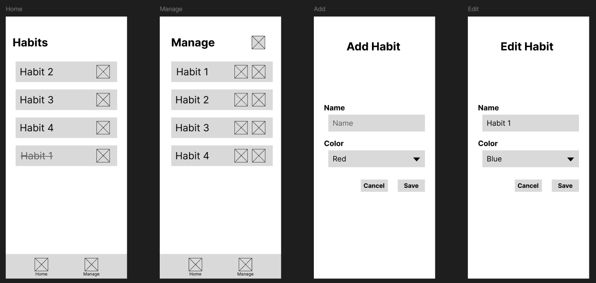

# BetterBee
### by Kaja (cc231049) & Zsanett (cc231070)

## Description
BetterBee: An application for tracking daily habits. Users can create, edit, delete the habits they want to keep track of in their day-to-day. 
The database is prepopulated with a few example habits for users to have a starting point and change as they wish. Habits can be checkmarked as done and are reset daily.

## App Concept
### Use case
Chosen Use Case: B - Wellbeing \
BetterBee would be used to help users who want to create a habit in their lives by keeping track of daily habits in the application and checking them off when they have been completed.

### Target User
* People who struggle with or want to get better at habits and routine
* People ages 18-39
* All genders
* All countries (but english speaking individuals)

### User Flow

### Mockups

## User Test Planning
### Heuristic Evaluation
System should generally be easy to use and navigate, due to its minimalistic design. However, the system status isn’t visible, there is no way to prevent errors or recover and no further documentation might leave users alone with their problems.

### Initial Questions
* How simple do the users find the app to be? (DV: Ease of use)
* How do users asses the usability of the app? (DV: Usability/SUS Score)
* What features could be improved or added according to users? (DV: Features to improve/add)

### Methods
* Test subject is given a phone with the app opened.
* Test subject is asked to perform certain scenarios (Add Habit, Mark Habit, Unmark Habit, Edit Habit, Delete Habit) and is then given a SEQ. Test subject is also encouraged to think out loud while performing the tasks.
* After the tasks, participants are given a SUS-Questionaire to fill out.
* Afterwards, a short interview is conducted to assess potential improvements and wishes by test subject.
