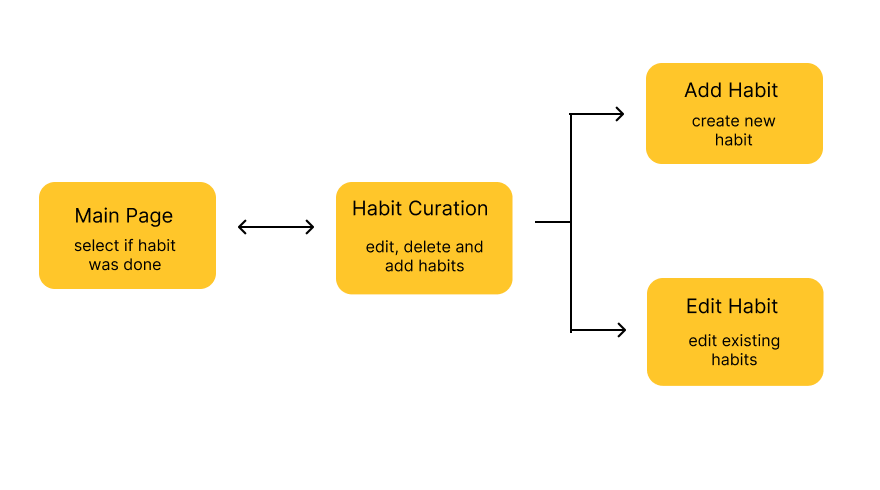
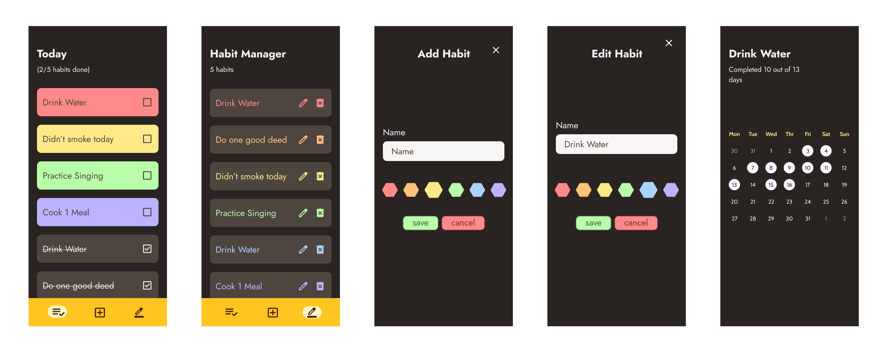
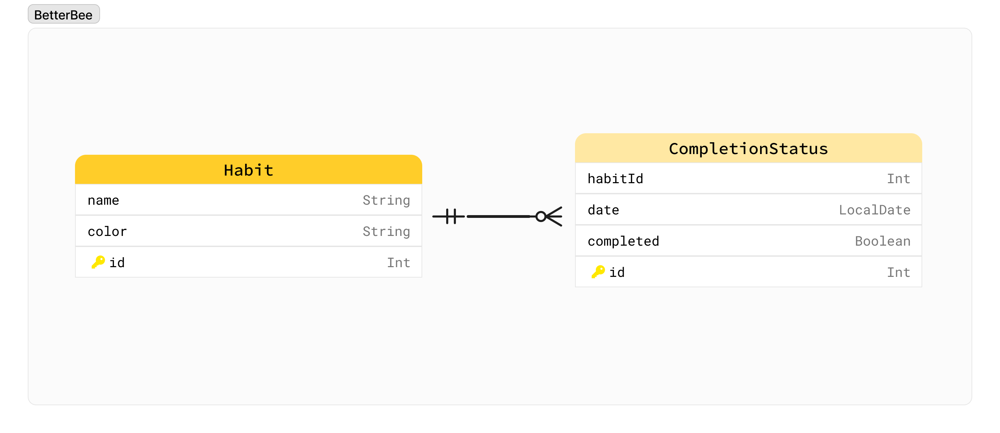

# BetterBee
### by Kaja (cc231049) & Zsanett (cc231070)
### [Repository here!](https://github.com/GegenteilVonGegenteil/BetterBee/tree/master)

## Description
BetterBee: An application for tracking daily habits. Users can create, edit, delete the habits they want to keep track of in their day-to-day. 
The database is prepopulated with a few example habits for users to have a starting point and change as they wish. Habits can be checkmarked as done and are reset daily.

## App Development
### Use case
Chosen Use Case: B - Wellbeing \
BetterBee would be used to help users who want to create a habit in their lives by keeping track of daily habits in the application and checking them off when they have been completed.

### Target User
* People who struggle with or want to get better at habits and routine
* People ages 18-39
* All genders
* All countries (but english speaking individuals)

### User Flow

### Mockups

### Screen Design

### Database Design

## Reflection
### Kaja
#### Contribution
Data Layer, Reset, Home/Manage/Detail View, User Testing

#### Challenges
THe biggest challenge for me was the reset, since we intended to do it on midnight with a WorkManager. While the it theoretically worked as intended when the app was open on reset, the phone would kill the schedueler upon closing the app, removing the purpose of the WorkManager. After two days of debugging and halp from lecutrers, we still couldn't figure out why this behavior was happening, as it seemed to be an issue with android, not the app. So we decided to do it differently, which wasn't hard to code, but not our intended way and also meant we didn't expand the WorkManager to do Notifications.

#### Meeting the initial concept
I think the app meets the inital concept completely, as users are able to create habits with custom names and color selection and edit/delete them, as well as them being able to check them off every day, with them resetting every day. We expanded on that concept with the detail view, which also offers insight into the history of haabit completion.

#### Further Improvements
I think there are many ways to build onto the app. Most importantly, I think the abbility to set custom intervals for habits would be nice, as well as notifications to remind the user to do them. A way to sort the order of the tasks would also be a great way for further customization.

## User Test Planning
### Heuristic Evaluation
System should generally be easy to use and navigate, due to its minimalistic design. However, the system status isn’t visible, there is no way to prevent errors or recover and no further documentation might leave users alone with their problems.

### Initial Questions
* How simple do the users find the app to be? (DV: Ease of use)
* How do users asses the usability of the app? (DV: Usability/SUS Score)
* What features could be improved or added according to users? (DV: Features to improve/add)

### Methods
* Test subject is given a phone with the app opened.
* Test subject is asked to perform certain scenarios (Add Habit, Mark Habit, Unmark Habit, Edit Habit, Delete Habit) and is then given a SEQ. Test subject is also encouraged to think out loud while performing the tasks.
* After the tasks, participants are given a SUS-Questionaire to fill out.
* Afterwards, a short interview is conducted to assess potential improvements and wishes by test subject.

### Results
#### Participants

#### Quantitative Evaluation

#### Qualtitative Feedback

#### Changes to Product
